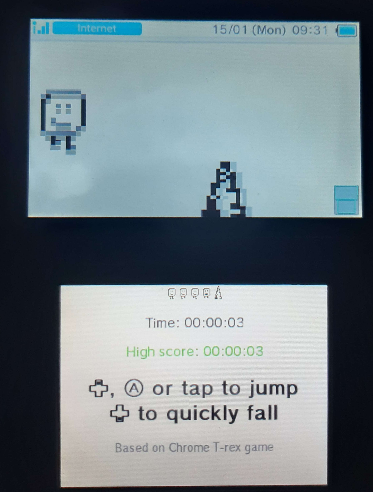

# 3DS web stuff
A work-in-progress collection of games and other stuff made specifically for the Nintendo 3DS web browser.
Does not require modding or installing additional software.

**Available at:**
https://wolfyxon.github.io/3ds-web-stuff

**Or scan the QR code to quickly launch the browser on your 3DS:**  

## Available stuff
- [x] Complete
- [ ] in progress
- Planned
### Games
- [x] [Jumpy](https://wolfyxon.github.io/3ds-web-stuff/games/jumpy) - jump and avoid spikes. Based on the Chrome dinosaur game.
- [x] [Tic Tac Toe](https://wolfyxon.github.io/3ds-web-stuff/games/ttt) - place X and O to make a pattern.
- [x] [Pigeon](https://wolfyxon.github.io/3ds-web-stuff/games/pigeon) - fly between pipes avoiding them. Based on Flappy Bird
- [ ] [Jet Fighter](https://wolfyxon.github.io/3ds-web-stuff/games/jetfighter) - Shoot em up game involving jets utilizing the both screens.
- [x] [Pong](https://wolfyxon.github.io/3ds-web-stuff/games/pong) - Play ping-pong with an AI.
- [ ] Tanks and Cannons - Tower defense game about tanks and cannons.
- Intercepter - take down the incoming missiles
- Miner - a mining game where you dig in the earth in search of rare minerals you can then sell.
- Maze - basically a randomly generated maze you have to find an exit of. It would contain different floors and some perks would be found inside the maze.
- Platformer - basically a jumping 2D game, however this would require creating some internal tools for map creation and loading.
- Sans - Holy crap sand undertable. (Sans boss fight recreation from UNDERTALE by Toby Fox)
### Other
- [x] [QR code generator](https://wolfyxon.github.io/3ds-web-stuff/other/qr) - turn text into a QR code.
- [x] [Calculator](https://wolfyxon.github.io/3ds-web-stuff/other/calculator) - just a simple basic calculator.
- [x] [Random number generator](https://wolfyxon.github.io/3ds-web-stuff/other/rand) - generate random numbers in a range
- [ ] Weather app - a weather app utilizing the [OpenMeteo](https://open-meteo.com/) API
- Paint - basically a drawing app
- Timer
- Barcode generator - turn text into a barcode.
- Unit converter - convert between units.
- Chat Room

## Screenshots

  
  
  
  
  

## Credits
Inspired by: http://three-ds.atspace.com/ (author unknown)

Big thanks to https://www.3dbrew.org/ and https://en-americas-support.nintendo.com/app/answers/detail/a_id/13802/~/nintendo-3ds-internet-browser-specs for helping with adapting to this old browser.

**This project is not affiliated with Nintendo, and it's only community driven.**

## TODO
Besides from planned games:
- [ ] Fix compatibility issues on Old 3DS/2DS
- [ ] Remake the home page and make it behave more like the home menu
- [ ] Make a camera system for the game.js library
- [ ] Create a map creator and loader for games

### 3rd party
#### QR code generation API
Docs: http://goqr.me/api/doc/  
Used URL: http://api.qrserver.com/v1/create-qr-code/?size=200x200&data=TEXT_HERE
#### Assets
-  [Backspace icon from Google Fonts](https://fonts.google.com/icons?selected=Material+Symbols+Outlined:backspace:FILL@0;wght@400;GRAD@0;opsz@24&icon.query=backspace)
