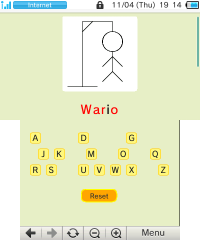
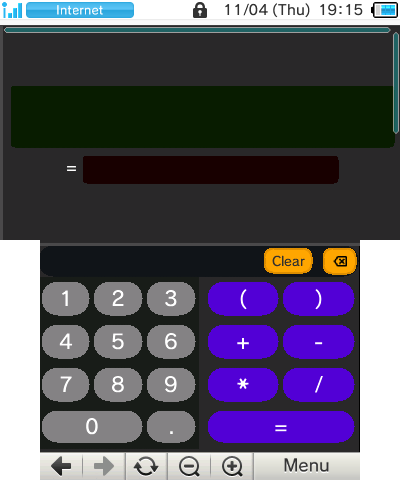
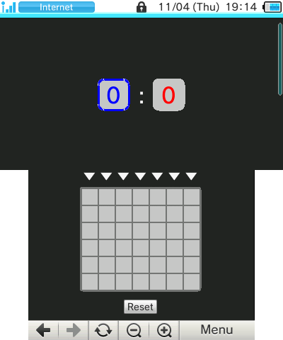

# 3DS web stuff
A work-in-progress collection of games and other stuff made specifically for the Nintendo 3DS web browser.
Does not require modding or installing additional software.

**Available at:**
https://wolfyxon.github.io/3ds-web-stuff

**Or scan the QR code to quickly launch the browser on your 3DS:**  

## Screenshots

  
  
  
  
  
  
  
  

## Available stuff
- [x] Complete
- [ ] in progress
- Planned
### Games
- [x] [Jumpy](https://wolfyxon.github.io/3ds-web-stuff/games/jumpy) - jump and avoid spikes. Based on the Chrome dinosaur game.
- [x] [Tic Tac Toe](https://wolfyxon.github.io/3ds-web-stuff/games/ttt) - place X and O to make a pattern.
- [x] [Pigeon](https://wolfyxon.github.io/3ds-web-stuff/games/pigeon) - fly between pipes avoiding them. Based on Flappy Bird
- [ ] [Jet Fighter](https://wolfyxon.github.io/3ds-web-stuff/games/jetfighter) - Shoot em up game involving jets utilizing the both screens.
- [x] [Pong](https://wolfyxon.github.io/3ds-web-stuff/games/pong) - Play ping-pong with an AI.
- [x] [Minesweeper](https://wolfyxon.github.io/3ds-web-stuff/games/minesweeper) - Uncover tiles and watch out for the mines!
- [ ] [Breakout](https://wolfyxon.github.io/3ds-web-stuff/games/breakout) - a Atari Breakout clone
- [x] [Sudoku](https://wolfyxon.github.io/3ds-web-stuff/games/sudoku) - Fill the table with numbers
- [x] [Connect 4](https://wolfyxon.github.io/3ds-web-stuff/games/connect4) - Connect 4 points
- [x] [Hangman](https://wolfyxon.github.io/3ds-web-stuff/games/hangman) - Guess the word
- [x] [Simon](https://wolfyxon.github.io/3ds-web-stuff/games/simon) - Remember the lights
- [x] [Snake](https://wolfyxon.github.io/3ds-web-stuff/games/snake) - Eat apples to grow
- [x] [Picross](https://wolfyxon.github.io/3ds-web-stuff/games/picross) - Fill the cells

- Intercepter - take down the incoming missiles. Based on Missile Command
- Clicker - a Cookie Clicker clone
- Miner - a mining game where you dig in the earth in search of rare minerals you can then sell.
- Maze - basically a randomly generated maze you have to find an exit of. It would contain different floors and some perks would be found inside the maze.
- Platformer - basically a jumping 2D game, however this would require creating some internal tools for map creation and loading.
- Tanks and Cannons - Tower defense game about tanks and cannons.
- Sans - Holy crap sand undertable. (Sans boss fight recreation from UNDERTALE by Toby Fox)

### Other
- [x] [Coder](https://wolfyxon.github.io/3ds-web-stuff/other/coder) - Turn text into encoded images
- [x] [Calculator](https://wolfyxon.github.io/3ds-web-stuff/other/calculator) - just a calculator.
- [x] [Random number generator](https://wolfyxon.github.io/3ds-web-stuff/other/rand) - generate random numbers in a range
- [x] [Hack](https://wolfyxon.github.io/3ds-web-stuff/other/hack) - very real hacking interface
- [x] [Unit Converter](https://wolfyxon.github.io/3ds-web-stuff/other/unitConverter) - convert between units
- [x] [Timer & stopwatch](https://wolfyxon.github.io/3ds-web-stuff/other/timer) - measure time
- [ ] [Brush](https://wolfyxon.github.io/3ds-web-stuff/other/brush) - basically a drawing app
- [ ] Chat Room - global online web chat
- [ ] Weather app - a weather app utilizing the [OpenMeteo](https://open-meteo.com/) API

## Credits
Inspired by: http://three-ds.atspace.com/ (author unknown)

Big thanks to https://www.3dbrew.org/ and [3DS Browser specs by Nintendo](https://en-americas-support.nintendo.com/app/answers/detail/a_id/13802/~/nintendo-3ds-internet-browser-specs) for helping with adapting to this old browser.

**This project is not affiliated with Nintendo, and it's only community driven.**

### People
- @Wolfyxon : programming, site design, sprites
- @magiczocker10 : huge code improvements. Creator of [Minesweeper](https://wolfyxon.github.io/3ds-web-stuff/games/minesweeper), [Connect 4](https://wolfyxon.github.io/3ds-web-stuff/games/connect4), [Hangman](https://wolfyxon.github.io/3ds-web-stuff/games/hagman) and some other games. Screenshots.
- @basic-experimental: Creator of [Picross](https://wolfyxon.github.io/3ds-web-stuff/games/picross) and support for various new image codes in [Coder](https://wolfyxon.github.io/3ds-web-stuff/other/coder)
- @Trickiy : amazing game ideas and detailed bug reports
- @iHeolity : testing

## TODO
Besides, from planned games:
- [ ] Improve snake move button elements
- [ ] Make helicopters in jetfighter not fly too low (they become impossible or hard to hit)
- [ ] Fix compatibility and performance issues on Old 3DS/2DS
- [ ] Create a faster rendering library
- [ ] Put all library functions in namespaces instead of importing them right onto the script
- Migrate all games using canvasGame.js to the new rendering library
- Remake the home page and make it behave more like the home menu
- Create a map creator and loader for games
- Create a 3D rendering library

### 3rd party
#### QR code generation API
Docs: http://goqr.me/api/doc/  
Used URL: http://api.qrserver.com/v1/create-qr-code/?size=200x200&data=TEXT_HERE
#### Assets
Some button icons are from https://fonts.google.com/icons
